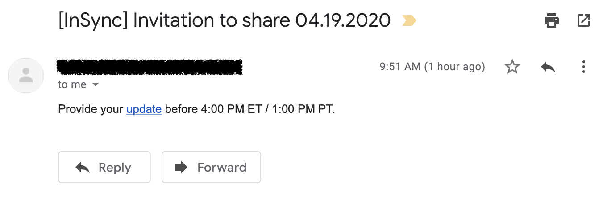
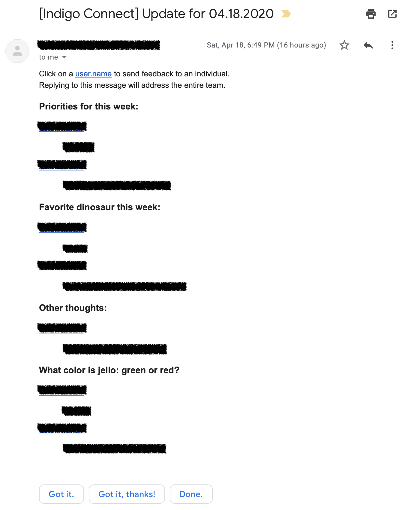
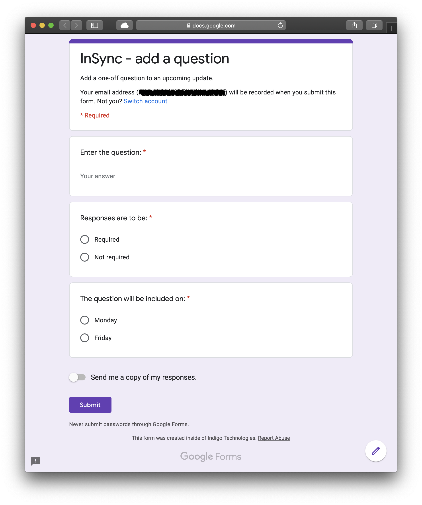

# GrumbleSpot  
(aka thePoint, InSync, Indigo Connect) A free alternative to paid services like Humble Dot that is based on Google Forms and powered by Apps Script.

## Features
- Scheduled invitations for form-based updates are sent out to team members (Monday and Friday morning).
- Scheduled summaries of team members' updates is sent out to team members  (Monday and Friday afternoon).
- Summaries include convenient pre-populated mailto links for sending feedback to individual team members about specific items.
- Flexible and extensible Apps Script/JavaScript back-end.
- Easy form-based system for adding one-off questions to upcoming updates.
- Prior to sending out a summary email, the script stores questions and results in a record, for posterity.

## Benefits
- No need to log in to third party services if your team already uses G Suite.
- Data is stored in Google Forms and Google Sheets, so if your team already trusts G Suite, then there is no need to worry about the security of sensitive project data being stored on third-party servers.
- Free = no monthly per-user fee for an essentially simple service.

  
  
  

## Set-up
1. Create a [Google Form](forms.google.com) to be used for adding one-off questions to upcoming update forms.
   - Take note of the form's unique ID.
   - Take note of the published URL.  Share this with those who should have the ability to add questions.   
1. Create a [Google Script](script.google.com) project.  
   1. Copy the contents of *Code.gs* into the script editor.  
   1. Set up the registry; this will store configuration parameters including email addresses, questions that will be asked during every update, and a record of past questions and responses.  
      1. Run the ``bootstrap`` function to generate a new registry spreadsheet and link it to the script via the script properties.
      1. Open the new spreadsheet (*insync_registry*) in [Google Sheets](sheets.google.com).  
      1. Navigate to the *email* sheet and add user email addresses to the column labeled *team_email_addresses*.  
      1. Navigate to the *ids* sheet.  In the cell next to *add_question_form_id* enter the unique ID of the form for adding questions that you collected earlier.  Leave the cell next to *form_id* empty; the script will populate this value automatically.
   1. Back in the script editor, navigate to Edit → Current project's triggers. Create a time trigger for either a Monday or Friday morning invitation to fill the update form.  From this point on, the script will perpetually delete and create triggers as needed.
   1. *(Optional)*  To add basic Markdown support: in the same Google Script project, copy and paste the contents of *nanomd.gs* into a new script file.  

## How it works
1. The script reuses the same form container; the questions and responses are cleared prior to sending an invitation.
  **To be continued.**

