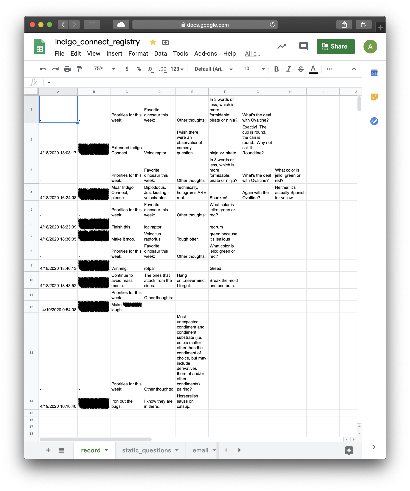
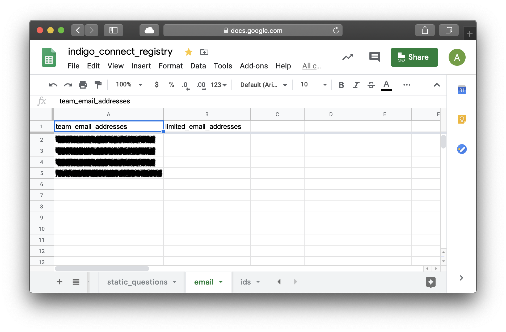
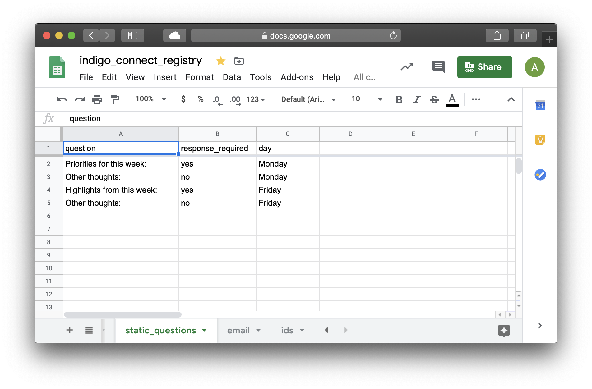
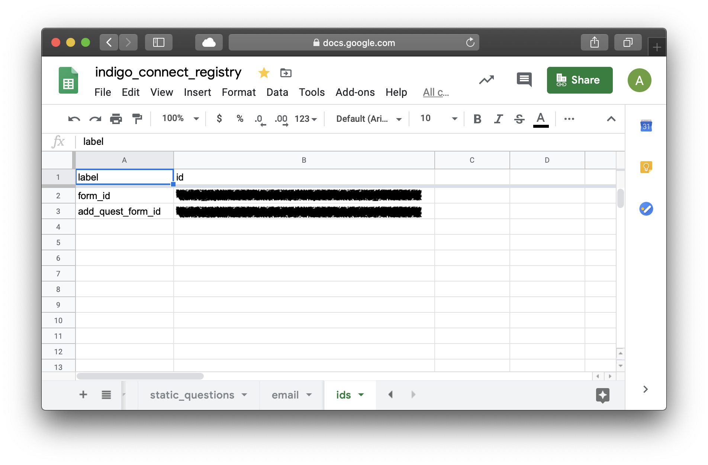
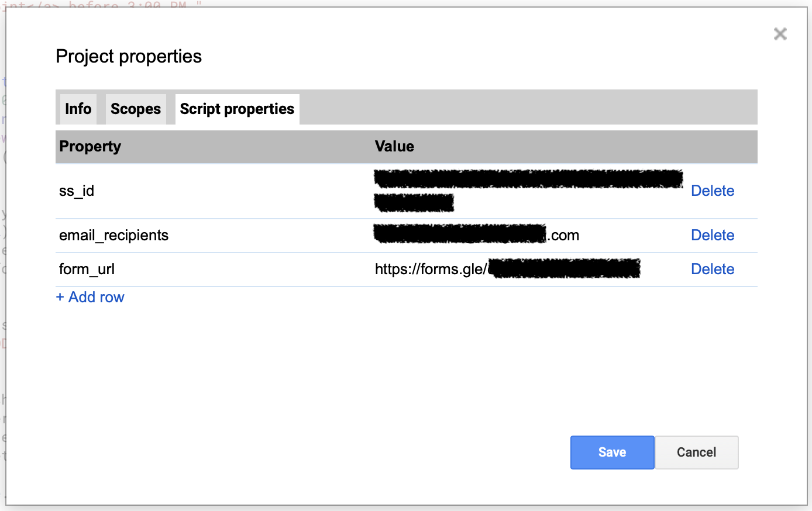

# GrumbleSpot  
(aka thePoint, InSync, Indigo Connect) A free alternative to paid services like Humble Dot that is based on Google Forms and powered by Apps Script.

## Features
- Scheduled invitations for form-based updates are sent out to team members (Monday and Friday morning).
- Scheduled summaries of team members' updates is sent out to team members  (Monday and Friday afternoon).
- Summaries include convenient pre-populated mailto links for sending feedback to individual team members about specific items.
- Flexible and extensible Apps Script/JavaScript back-end.
- Easy form-based system for adding one-off questions to upcoming updates.
- Prior to sending out a summary email, the script stores questions and results in a record, for posterity.

## Benefits
- No need to log in to third party services if your team already uses G Suite.
- Data is stored in Google Forms and Google Sheets, so if your team already trusts G Suite, then there is no need to worry about the security of sensitive project data being stored on third-party servers.
- Free, so no monthly per-user fee for an essentially simple service.

  
  
  

## Set-up
Refer to the screen shots for insight regarding setting up your own implementation.
1. Create a [Google Form](forms.google.com) to be used for adding one-off questions to upcoming update forms.
   - Take note of the form's unique ID.
   - Take note of the published URL.  Share this with those who will have the option to add questions.
     
1. Create a [Google Sheet](sheets.google.com) to serve as the registry; this will store configuration parameters and a record of questions and responses.  Take note of the spreadsheet's unique ID.
  1. Create a sheet named *record*.  This will contain a record of questions and responses.
     
  1. Create a sheet named *emails*.  This will contain lists of email addresses.
       
  1. Create a sheet named *static_questions*.  This will contain questions that will be included in every update form.
     
  1. Create a sheet named *ids*.  This will contain unique IDs for the update form and the form used to add questions.
     
    - Replicate the sheet content shown in the following image.  In the field next to *add_question_form_id* enter the unique ID that you collected earlier for the form for adding questions.  Leave the field next to *form_id* empty; the script will populate this field automatically.
1. Create a [Google Script](script.google.com) project.
  1. Copy contents of Code.gs into the Script Editor.
  1. Set File → Project properties → Script properties.
     
  1. Edit → Project triggers and create a time trigger for either a Monday or Friday morning invitation to fill the update form.
    - From this point on, the script will perpetually delete and create triggers as needed.

## How it works
1. The script reuses the same form container; the questions and responses are cleared prior to sending an invitation.
  **To be continued.**

