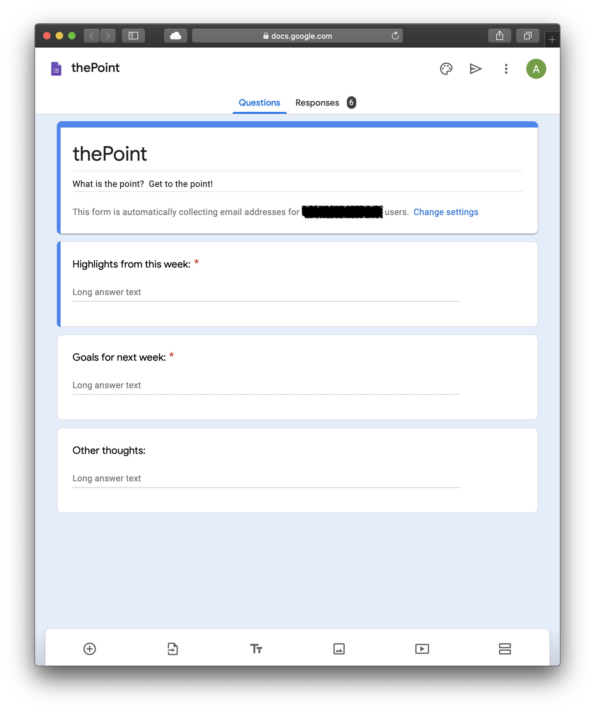
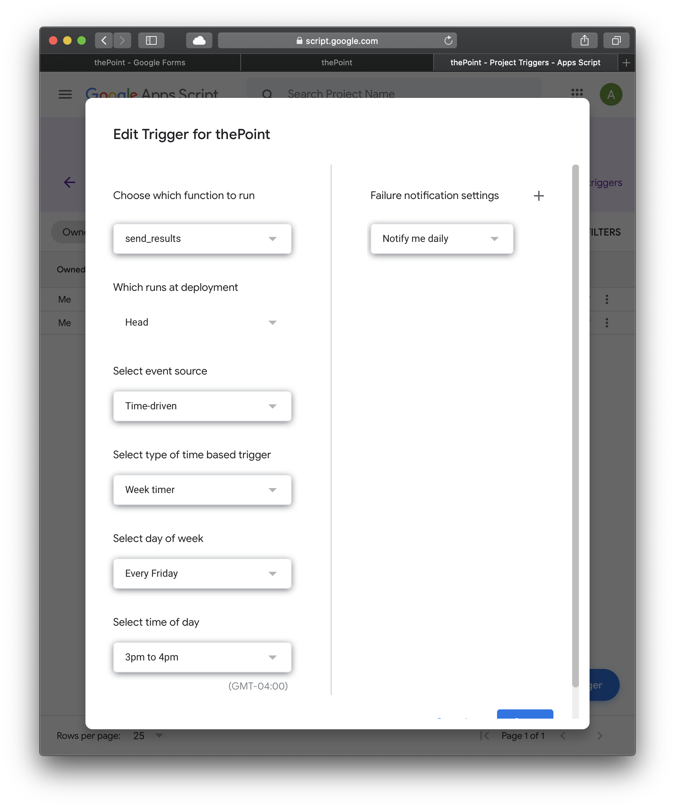

# GrumbleSpot
(aka thePoint) A free alternative to paid services like Humble Dot that is based on Google Forms and powered by Apps Scripts.

- Time scheduled invitations for form-based updates are sent out to team members.
- Time scheduled summary of team members' updates is sent out to team members.
- Summary includes convenient links for sending feedback to individual team members about specific items.
- No need to log in to third party services if your team already uses GSuite.
- Data is stored in Google Sheets, so if you trust GSuite, then there is no need to worry about the security of sensitive project data being stored on third-party servers.
- Flexible and extensible Apps Script (Javascript) back-end (Script Editor may be accessed from Google Forms).
- Free, so no monthly fee per user for a simple service.
- See screen shots for insight on setting up your own implementation.
- Implementation specific parameters are at the top of Code.gs.
- Copy contents of Code.gs into Google Forms Script Editor.

